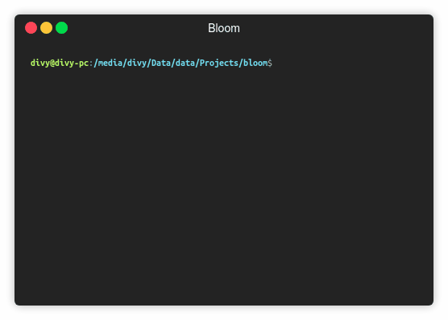
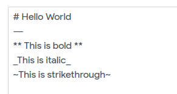

## Introduction
A powerful open-source blogging engine built for humans, by humans.

[](https://www.codacy.com/app/DivySrivastava/bloom?utm_source=github.com&amp;utm_medium=referral&amp;utm_content=DivySrivastava/bloom&amp;utm_campaign=Badge_Grade)


## Features
  * Simplicity
  * HTML and Markdown support.
  * Interactive web and command-line interface.
  * Blazing fast rendering speed.
  * Wonderful user-friendy CLI.
  * Easy deployment.
  * No database needed.
  * Theme addons supported.

## Installation

  First clone the repository on your local computer and install all the dependencies.

  

  Now you can access your blog from `localhost:8080`

## Usage  
  So Assuming that your bloom server is running locally on port 8080.

  You and your viewers can now access the blog home page on http://localhost:8080
  ### Accessing the admin console
  * Go to http://localhost:8080/console
  * You will have to login with your username and password you entered while setup.
    You can find your username and password inside `_data/config.json`.
    ```js
    {
      "title": "MyBlogTitle", // Blog title
      "website": "https://myblog.com", // Website url
      "author": "YourName", // Author's name
      "host": "localhost", // Server host
      "port": "8080", // Server Port
      "username": "admin", // Your username
      "password": "admin123" // Your password
    }
    ```
    Anyone with the username and password can access the blog console.
  * Enter the username and password on the console login page.
  * You will be redirected to the console page. Viola!


  ### Creating a blog post
  * Once you are on the console page, click on `New Post` button.
  * You have now a fresh new blog template ready to edit.
  * Editing is easy-peasy. Just fill in the basic information of your post.
    * Enter the blog title (be specific and not too long).

    

    * Enter the blog description (elaborate more on the topic).

    

    * Finally write your post in Markdown and HTML.

    

    * You can preview your page by clicking the `Preview` button on the page.
    * Once you're done, submit the post by clicking on `Post` button on the top-right corner of the page.

    

## Contribution

To contribute,
Fork this repository and clone the fork on your local machine via git.

```bash
  $ git clone https://github.com/<YourUsername>/bloom
```
Now, you can freely play with the code and when you think you have added or improved some stuff, push it to your forked repo and create a pull request.
Give a nice and brief note of what you have done.

Remember, do not explain what your code does... rather tell what effect it does to the project.

Before contributing, read the [code of conduct](./docs/CODE_OF_CONDUCT.md)

Contribute to this documentation by creating a pull request.

## Authors

* [Divy Srivastava](https://divy.work)
* [Dan](https://dancodes.online)

## Logo

The logo is created by using an online tool which does not provide any license for usage.
Therefore, It is now licensed under MIT license.

## License

(The MIT License)

Copyright (c) 2019 Divy Srivastava <dj.srivastava23@gmail.com>

Permission is hereby granted, free of charge, to any person obtaining
a copy of this software and associated documentation files (the
'Software'), to deal in the Software without restriction, including
without limitation the rights to use, copy, modify, merge, publish,
distribute, sublicense, and/or sell copies of the Software, and to
permit persons to whom the Software is furnished to do so, subject to
the following conditions:

The above copyright notice and this permission notice shall be
included in all copies or substantial portions of the Software.

THE SOFTWARE IS PROVIDED 'AS IS', WITHOUT WARRANTY OF ANY KIND,
EXPRESS OR IMPLIED, INCLUDING BUT NOT LIMITED TO THE WARRANTIES OF
MERCHANTABILITY, FITNESS FOR A PARTICULAR PURPOSE AND NONINFRINGEMENT.
IN NO EVENT SHALL THE AUTHORS OR COPYRIGHT HOLDERS BE LIABLE FOR ANY
CLAIM, DAMAGES OR OTHER LIABILITY, WHETHER IN AN ACTION OF CONTRACT,
TORT OR OTHERWISE, ARISING FROM, OUT OF OR IN CONNECTION WITH THE
SOFTWARE OR THE USE OR OTHER DEALINGS IN THE SOFTWARE.
